# 300元  大战3a

## 介绍

之前在闲鱼淘了一套主机＋显示器，然而适应过程中感觉显卡性能实在有点弱，于是准备加个显卡，预算尽量低，因为之前用过rx5500xt，感觉性能还不错，能达到接近性能就满足了，rx580差不多，但是价格也在300多，而且还是矿卡，倒不如直接买个矿卡，感觉p106-100性能不错，也很便宜才100多，不过听说有一定使用门槛，查了一下教程发现其实也不算难，比黑苹果简单多了，最终闲鱼蹲了一段时间后，以115元的价格从一位个人买家手里收了一张。接下来我介绍一下我在用p106中踩到的一些坑，以及性能实测

## 配置介绍

| 名称  | 型号                   | 价格   |
| --- | -------------------- | ---- |
| cpu | i5 3450              | 原机自带 |
| 主板  | 映泰hifi-z77x          | 原机自带 |
| 内存  | 芝奇 ddr3 1333 4g\\\*2 | 原机自带 |
| 散热  | 九州风神 冰刃玩家镀镍版         | 15   |
| 显卡  | 微星p106-100 （七彩虹bios） | 115  |
| 机箱  | 鑫谷雷诺塔T1              | 原机自带 |
| 电源  | 长城500w 双卡王           | 原机自带 |
| 硬盘  | 笔记本256 sata固态        | 0    |
| 显示器 | 明基m2400hd            | 原机自带 |
| 总价  | 160+115+15           | 290  |

## 配件特写

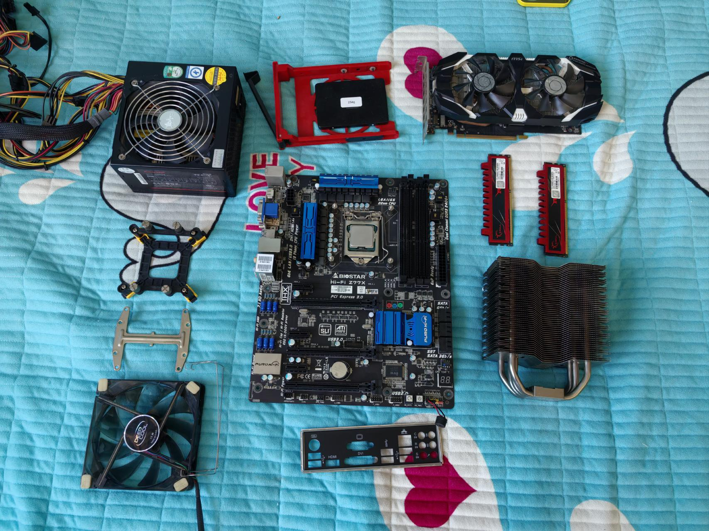

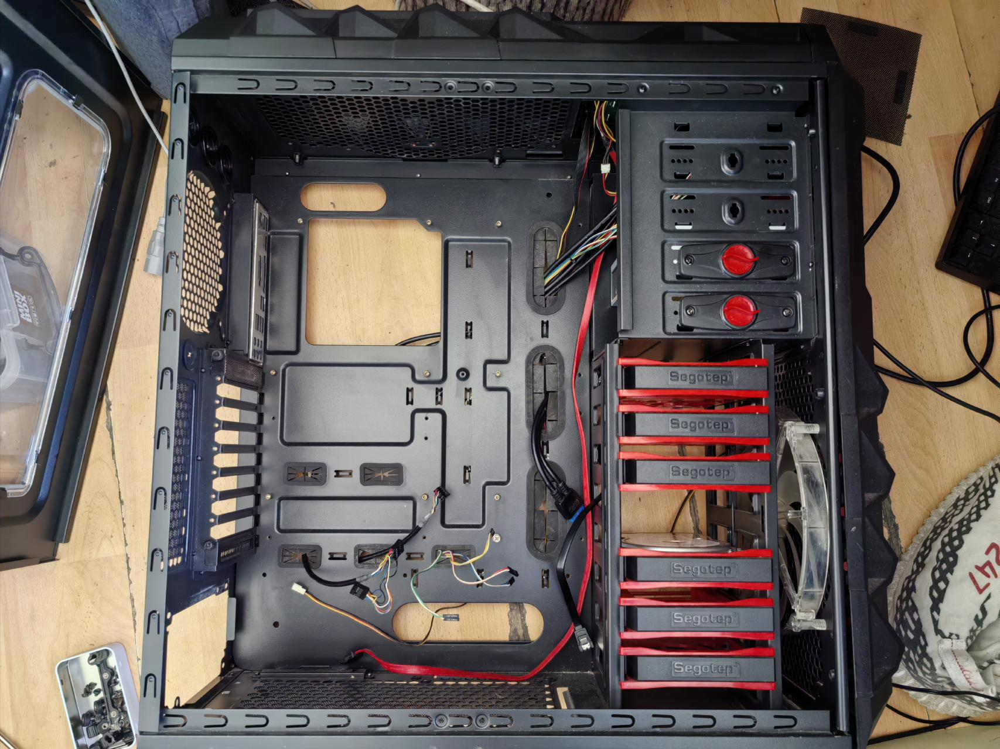

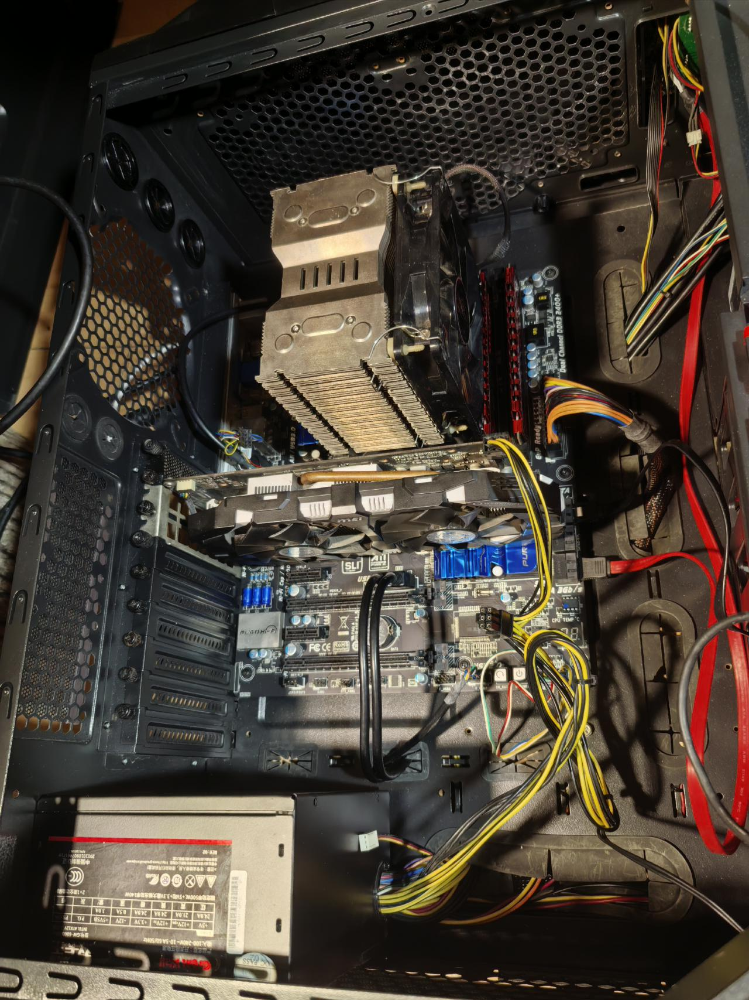

## 主板设置

1. **关闭csm**

> 📌注意：如果不关闭，直接安装windows，则很有可能安装成mbr分区格式，mbr据说不支持4t以上硬盘，安装p106必须要求是gpt分区格式，他俩的区别就是gpt分区格式化完了会有三个分区，mbr 不会

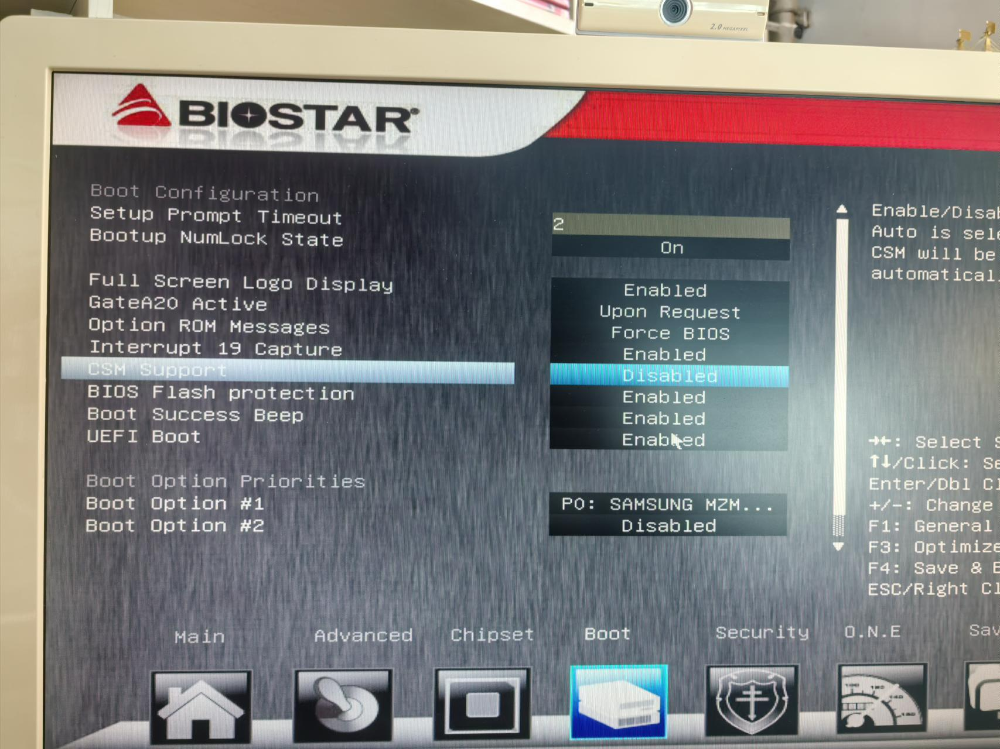

1. **设置核显启动**

找到主板北桥设置的地方，north bridge，有可能是简写nb-xxx

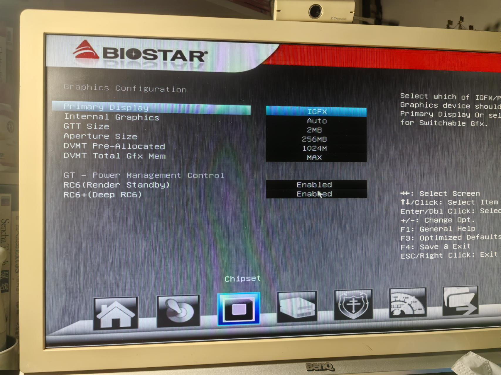

## 系统安装

**坑1 ：黄色背景白色条纹**

我使用的u盘安装，u盘引导之后，进入到一个橘黄色背景，白色竖条纹的界面，卡主不动，后来经过测试，是由于我的usb3 的u盘插到了2.0的口上，之后插到了3.0上就好了

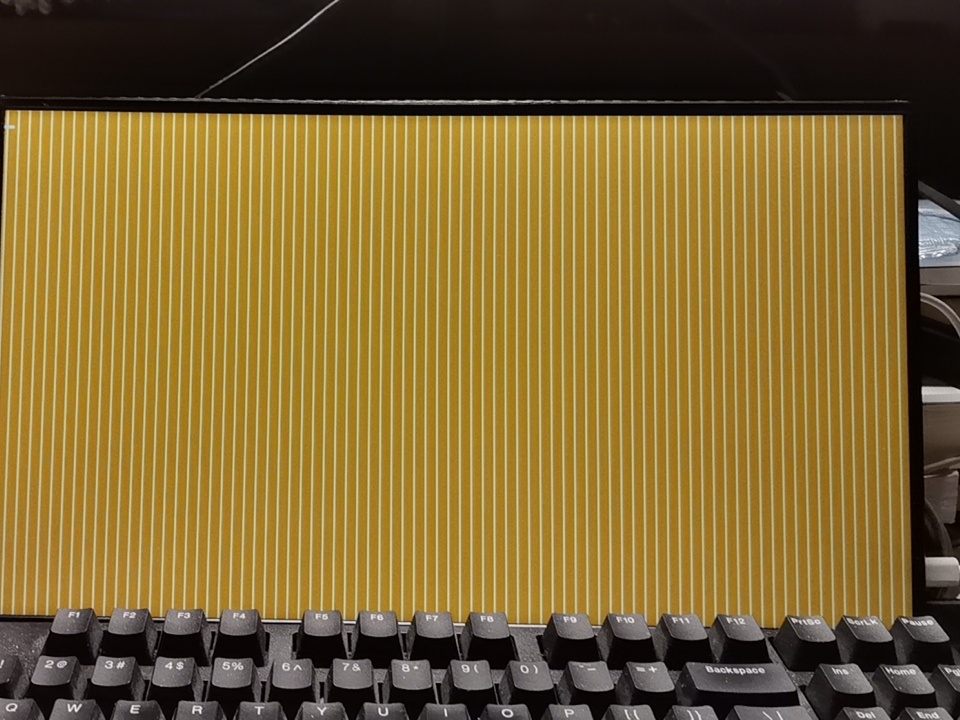

**坑2：硬盘总是装成mbr分区格式**

需要先在bios设置关闭csm，然后再安装，否则格式化的时候很可能不是gpt格式

## 驱动安装

> 📌安装之前要断网 断网！！！

1. **卸载旧显卡驱动**

由于我的是纯净安装的系统，所以不需要卸载之前的显卡驱动，系统默认会安装intel核显，这个不影响，如果是老系统，使用ddu先卸载旧驱动

1. **安装魔改驱动**

安装驱动基本就是什么设置不用点，一路下一步，nv显卡驱动界面  点击自定义安装 勾选一下清洁安装，保险一点，安装完了这个时候显卡就能在设备管理器里识别出来了

雨糖 魔改驱动下载地址：

[http://raincandy.tech/nvcmpgpu/](http://raincandy.tech/nvcmpgpu/ "http://raincandy.tech/nvcmpgpu/")

1. **添加注册表**

不需要手动添加注册表，执行批处理文件，通过程序添加，由于我的是3代处理器所以下载了3代的批处理文件，这个批处理是大佬给编写的，以前应该是手动添加，省事不少，根据提示从第2步开始执行，每次按照提示选择p106对应的序号既可

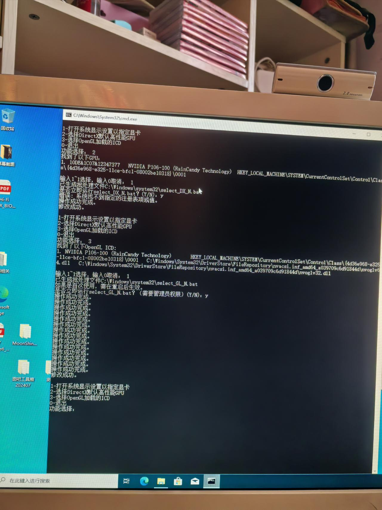

## 性能调优

**gpu-z验证是否为x16**

安装完成我用gpuz看了一下，发现运行在x2 速度，看其他人都是x16，经过询问卖家他能跑x8，因为他是amd的cpu，按理说我的应该能跑x16

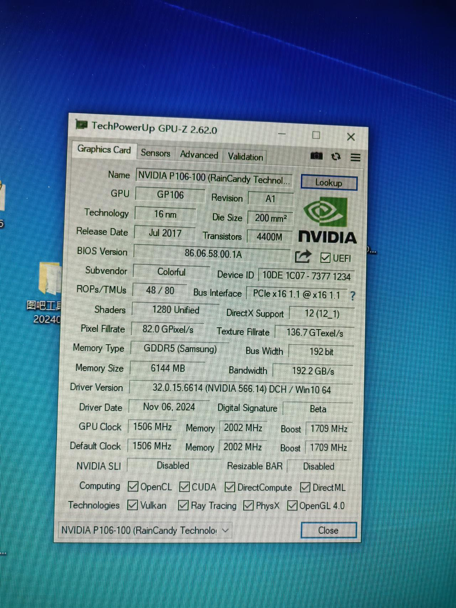

### 如果达不到x16从以下几个点来排查

**排查主板设置**

这个因主板而异，我有两个z77主板，一个是华擎，一个是映泰，一般来说自动识别，但是也有个例

比如我的**华擎z77极限玩家6**就是需要设置指定pcie是几代的，这个跟主板的pcie拆分策略有关系，这个要查看一下主板的说明书，看看是按照什么策略拆分的，我的主板默认都设置自动，共三个插槽，前两个是x8，最后一个x4，如果第一个设置pcie2，才可以是x16，我还以为会自动识别，这个问题卡了很久

但是**映泰**的主板就没有这个问题，只要是插实了就会自动识别x16

经过我的测试，发现其实x16和x8性能差距不大，鲁大师就差了小几千分

**排查供电**

如果显卡6pin供电没有插紧，卡扣没有完全扣上，也可能导致速率是x8 或者x4，有可能平放机箱是x8，竖起来就是x4

**排查主板插槽积灰 和金手指**

由于我的主板之前都是用的核显，导致独显插槽会有一些积灰，使得金手指接触不良，用吹气球卡在插槽缝里吹，其次也可能是显卡金手指有些氧化，用橡皮擦金手指，直到擦到反光不发暗为止

## 性能实测

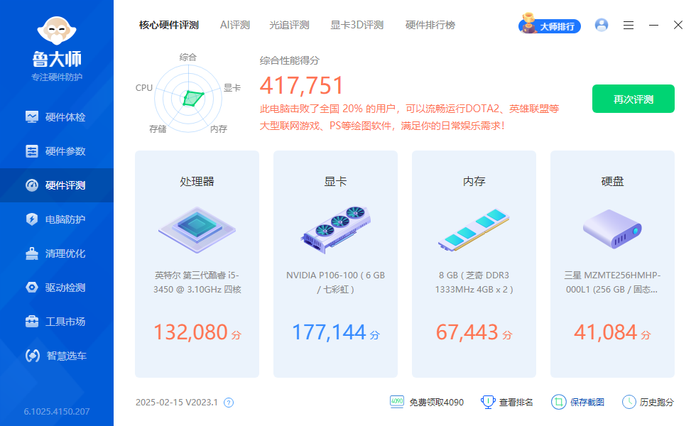

_tbxsFSVZC0.jpeg>)

## 游戏实测

黑神话悟空  基本60帧 中低画质1080p

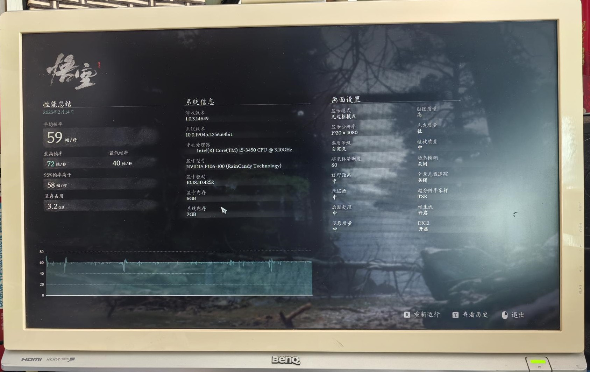

地平线5  中画质  1080p 60左右

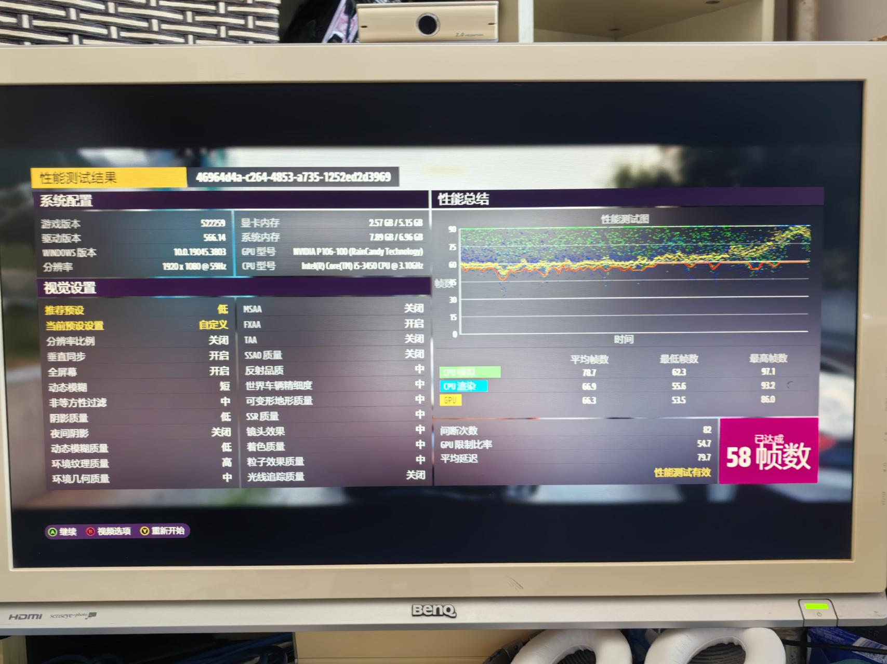

感觉性能基本可以达到3a门槛，可以在中画质比较流畅的玩一些3a大作了

## 功耗测试

跑timespy的时候看了一下整机的功耗，不到200w，还算省电

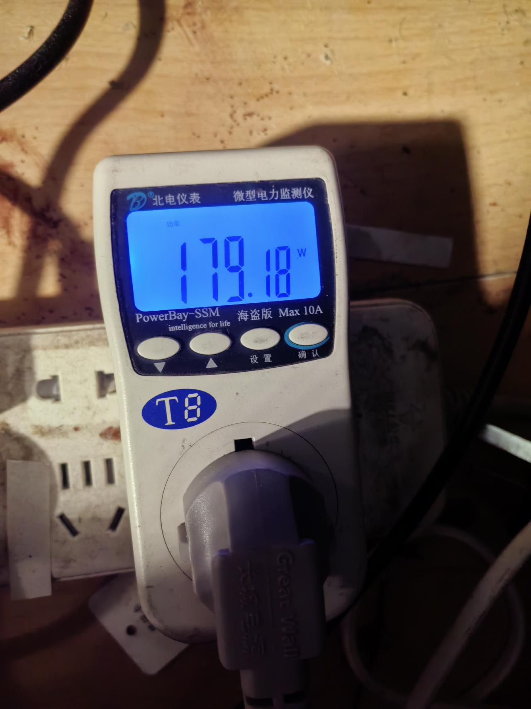
