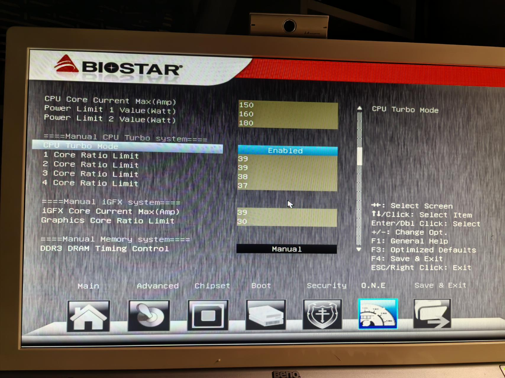
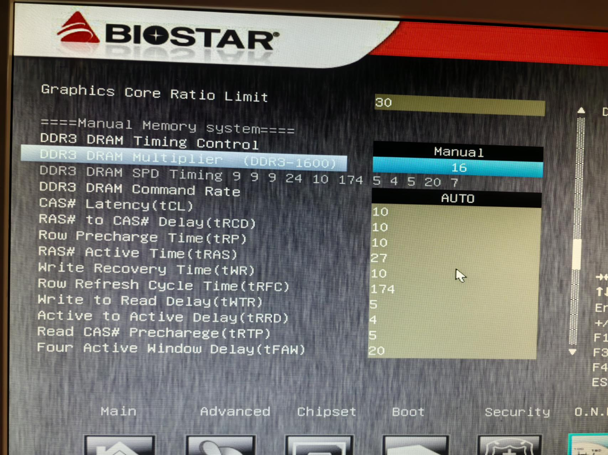
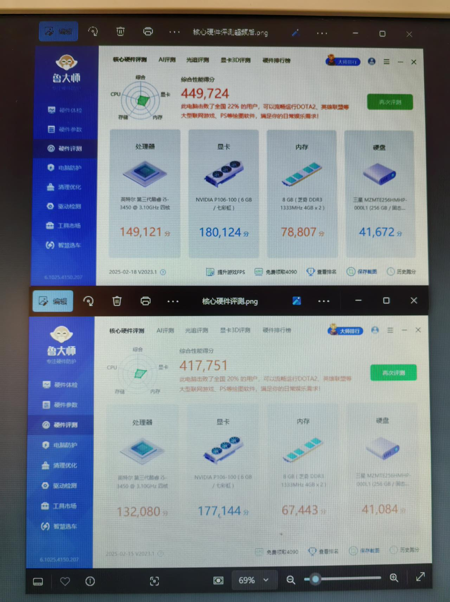

# 3450超频带p106

最近在用p106过程中，发现跑分一直是17.7w左右，别人基本都是18w多，感觉有可能是cpu处理器拉跨了，于是想超频尽可能发挥出p106实力，虽然我的是i5 3450，是个非k的cpu，但是我的主板是z77，可以免费获得4个倍频福利，性能也能提升一些，于是经过一系列摸索，总结如下

超频cpu：

首先turbo mode要是开启状态，不支持超频的主板应该就没有turbo mode这个选项，下面可以设置不同核心时候的主频，这里我手动输入40但是会被重置为39，可能intel芯片会有限制，其他几项也都是会有这个限制，改完如下图，单核最高3.9ghz

超频核显：

我的核显是hd2500，比较弱，所以超频核显应该带来提升最明显，

紧接着就是少贫核显的选项，core current max默认35，直接改成39

另外一个graphic core ratio limit  这个一看就是和核显有关的，默认22，我尝试过改成35，导致鲁大师跑分就会卡死，所以最后改成30稳定使用

超频内存：

我现在的内存是ddr3 1333两条，实在频率太低，超频到1600，一般体制基本都可以超上来，开始没有更改时许，原来是9，9，9，24，但是运行中不是很稳定，虽然能过tm5 但是偶尔会蓝屏，于是提高了一下，改成10，10，10，27，现在运行各种游戏也没有出现蓝屏的情况

以上就是我超频这三个点的地方，接下来看下改完后的跑分对比

上面是超频完了的，下面是之前的，之前的cpu跑分取了跑的最高的一次

可以发现显卡终于可以跑到了18w，cpu也是增长到接近15w，内存7.8w，虽然显卡看上去不多，实际上我的机器16x和8x的分数也只差2k左右，由此可见增幅还算可以

之前还入手了两个8g内存，等到货在加上，应该就是最终的形态了，基本就可以再战几年了
