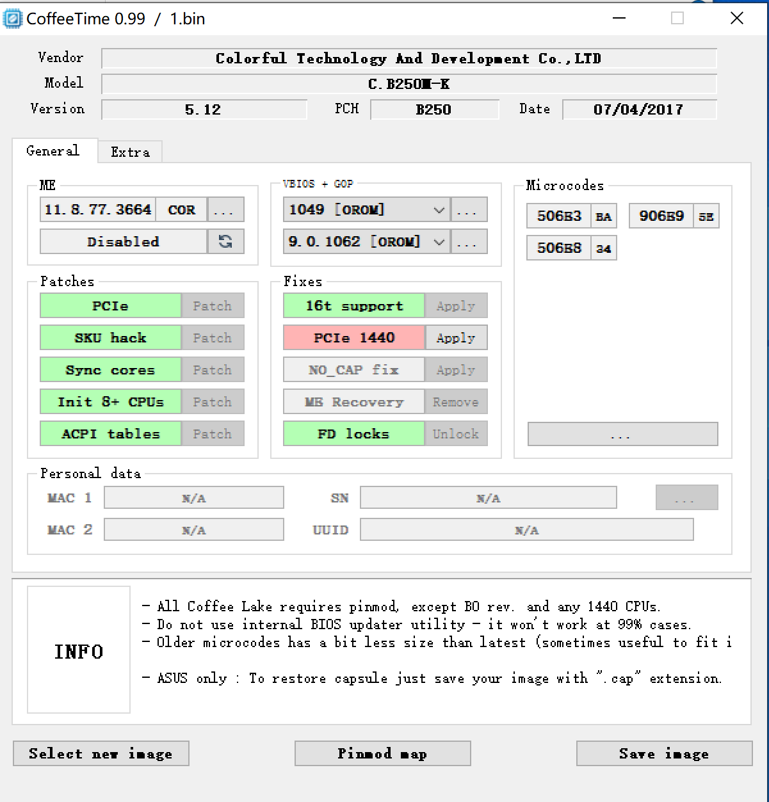
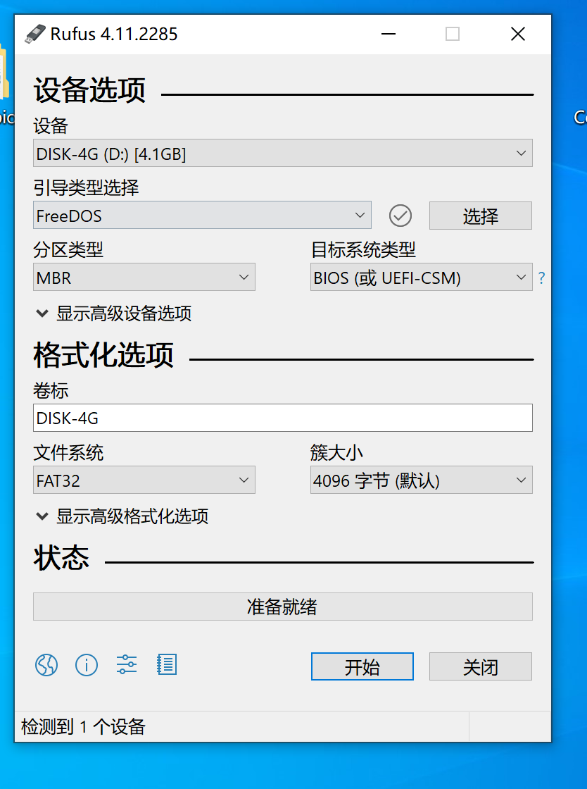
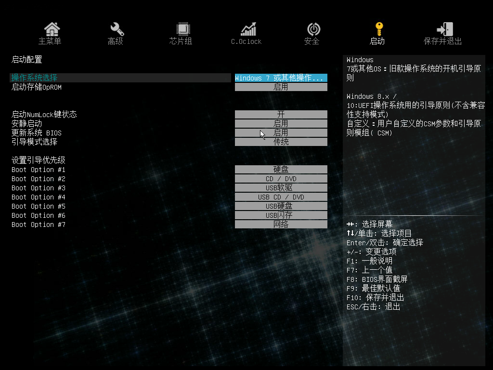

# 七彩虹 b250m-k v20 bios 魔改教程

## 说明
主要是为了使用e3-1230v5 cpu，这个是7代主板，如果不刷bios应该不能使用志强的cpu

下载coffee-time
下载地址：https://gitcode.com/open-source-toolkit/425c1.git

## 魔改设置如图

## 刷bios准备 一个u盘创建dos引导
如图设置，使用rufus制作dos启动盘

## 重启进入bios设置
如图

这里由于u盘制作是mbr分区，这里只能设置使用windows7，传统引导 才能进入dos

进入dos之后，是类似命令行的页面，输入`dir/w`可以显示出所有文件

## 刷入bios
输入指令  `fpt -bios -f 1.bin`  这里1是魔改之后的bios文件

说明： 不要使用官方的update.bat 内置的指令有报错，需要追加-bios前缀才可以

上E3-1230v5 不需要魔改针脚

## 性能测试
待测试