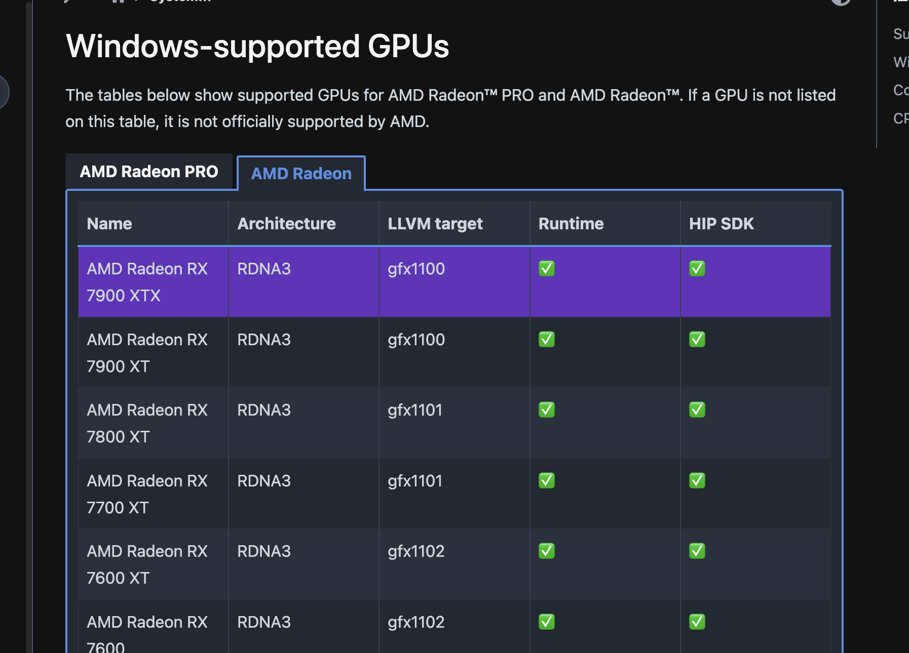
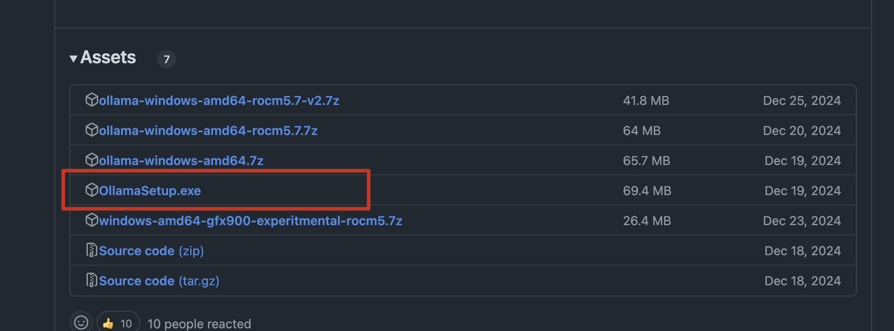
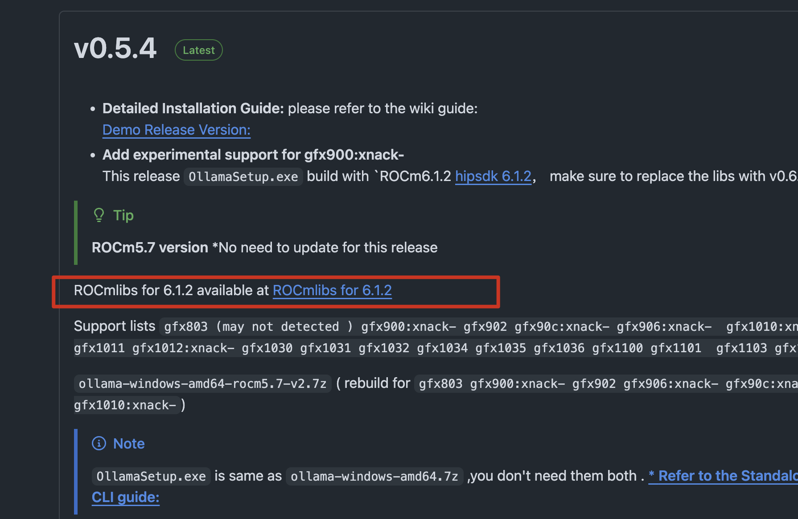
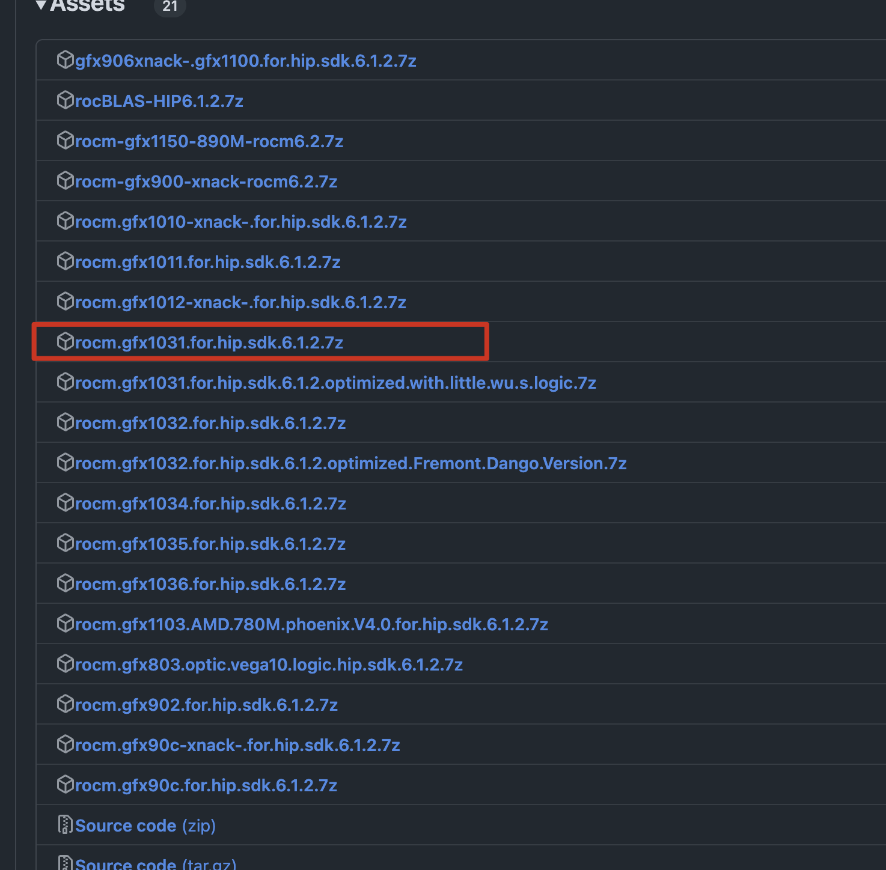
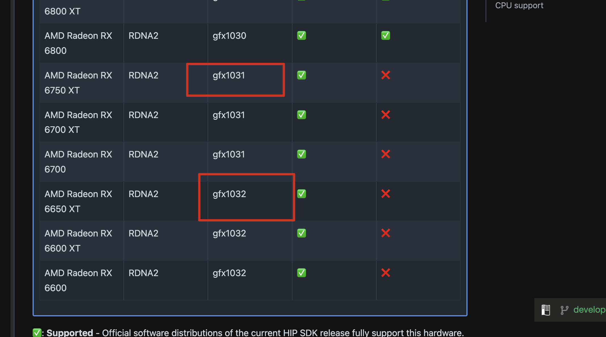

# 本地部署

# 确认配置

我的电脑配置如下：

| 类型  | 型号            |
| --- | ------------- |
| cpu | 12600kf       |
| 显卡  | rx6750gre 12g |
| 内存  | 8g\\\*2 ddr4  |
| 硬盘  | 1T M.2固态      |

# 确认需求

因为deepseek满足不同的需求需要，所以仅仅是尝鲜，或者轻度使用就不需要太高，结合自己的配置选择，基本就按照现存大小分，12g显存就选了14b，8g显存就8b

# 安装ollama

根据系统去 [官网下载](https://ollama.com/library/deepseek-r1 "官网下载")，如果是amd显卡可能需要安装特定版，后面介绍
windows基本就是一路下一步

# 拉取deepseek模型

安装完ollama会自动打开powershell  ，此时执行ollama官网给出的指令既可自动拉取模型，14b的模型有9g左右

`ollama run deepseek-r1:14b`

# 安装ui界面

安装完模型，直接就在命令行里可以提问了，但是此时还是感觉交互上不太友好，就可以搭建一个webui界面，我尝试了以下两种ui界面方式

1. 使用**open-webui**

安装[python3.11](https://www.python.org/downloads/release/python-3110/ "python3.11")，只能是这个版本，避免太高版本出问题，

安装最后，要记得勾选添加到环境变量

安装完在控制台执行python查看是否进入python环境

使用下面脚本安装`pip install open-webui`

安装完，先启动deepseek，控制台执行`ollama serve`

新开控制台启动ui，执行`open-webui serve`

默认启动的是8080端口，直接使用**0.0.0.0:8080**访问就好

1. 也可以使用谷歌商店搜索**PageAssist**，安装这个插件后，自动启动一个页面并识别到本地的模型

# 解决amd显卡无法调用的问题

试跑了一下，发现生成的字符很慢，打开任务管理器，发现显卡根本不干活，只有内存占用是满的，返现事情不对，一搜发现ollama只支持大多数N卡和少量的A卡，所以需要查看自己的显卡是否在官方默认支持范围内，如果不支持则需要参考以下步骤让他调用起来，成功调用后，是质的飞跃

以下步骤参考以下文章

[https://www.oneue.com/articles/2350.html](https://www.oneue.com/articles/2350.html "https://www.oneue.com/articles/2350.html")

B站up主视频参考

<https://www.bilibili.com/video/BV1VAfXYZE7S/>

首先去amd网站[ROCm是否支持](https://rocm.docs.amd.com/projects/install-on-windows/en/develop/reference/system-requirements.html "ROCm是否支持") 查看自己的显卡，两个对钩都打上才是默认可以调用

下载amd专属ollama和ROCm lib

[https://github.com/likelovewant/ollama-for-amd/releases](https://github.com/likelovewant/ollama-for-amd/releases "https://github.com/likelovewant/ollama-for-amd/releases")

下载ROCmlib要下载对应显卡型号的，不要下错，我的6750gre对应的是gfx1031，如果是6650xt则对应gfx1032

这点可以从上面的amd官网查到

**替换文件**

1. 找到ollama安装目录，

目录为：`C:\Users\用户名\AppData\Local\Programs\Ollama\lib\ollama`

1. 替换rocblas.dll

目录为：`C:\Users\用户名\AppData\Local\Programs\Ollama\lib\ollama\rocblas.dll`

1. 替换library目录

目录为：`C:\Users\用户名\AppData\Local\Programs\Ollama\lib\ollama\rocblas\library`

重启ollama查看日志是否已经调用显卡，或者直接看任务管理器显存是否占满了
