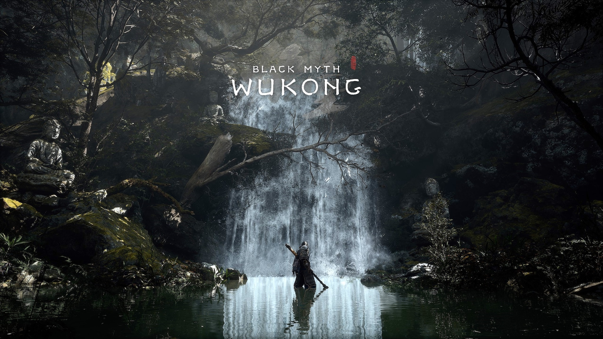
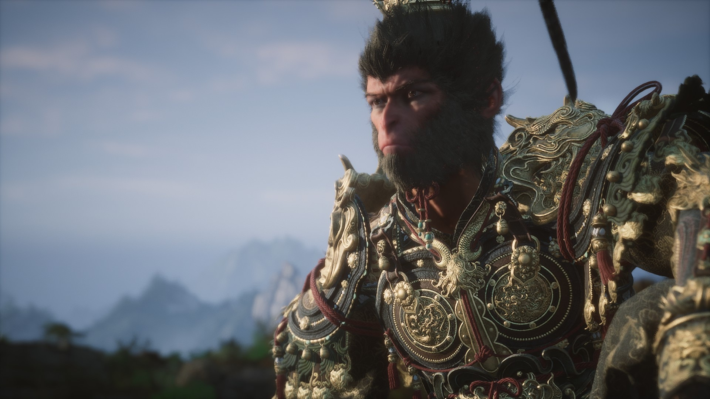

# 玩黑神话感悟

每个人都想成为大圣，但是不是每个人都能成为大圣

有的人卡在大头，直接退费了，

有的人卡在白衣，彻底崩溃了

人生就像黑神话一样，一直在不断击败一个个boss，过程中提升自己

## 棍法感悟
棍法需要一级一级练就 不是一下就拉到满级，先达成一个技能点再说，不断累计最后点满所有技能点。

## 技能点感悟
技能点数有限，要合理分配你的技能，类比就像我们每个人的时间能力都有限，你要合理分配用他们去锻炼你的某项技能，无论你锻炼哪项技能请坚持下去，不要这个练一点那个练一点，最后哪个都不精，就像游戏里，你可能把劈棍练满，干BOSS会容易一些，有的人就习惯立棍，戳棍，照样可以秒掉BOSS，看你熟悉哪种，熟能生巧，不断练习，大佬都是禁字法+完美识破。

## boss感悟
另外BOSS不是上来就能一次过，比如大头你可能上来级别很低，干他10几次都干不过，当绝对实力不够或者技术还没达到的时候可以换个思路，可以去先打广智，拿了赤潮再回来打可能就会容易一些，要不就是先去练练技能练练级再回来，可能我们遇到难题也一样可以考虑换个思路也许会更好解决

每个BOSS都有自己的属性和弱点，需要掌握他的弱点，针对性的克制，比如黑熊精和虎先锋弱火，那就用广智打可能相对容易一些，类比生活中，可能有些人或者事比较难搞定，可能就是没找到合适的方式方法，往往都会存在一些可以相对容易解决的方法等待我们去发现她

BOSS还有个特点就是你越怕他就越容易挂，越跑越不行，有的时候就需要硬上，就像我打小丽龙的时候，连续躲电圈还是躲不过去，最后想起黑风山有个猴子卖葫芦，升级了了葫芦，并且铸造了一下装备，回来继续打，就是硬上，把所有法术都用上，有电圈的时候就变身抗，最后一次过了，可以想到有时候稍微变通一下，再加上硬着头皮再试一次可能就能成功

最后我卡在了小黄龙和寅虎了，实在没过去，也不知什么时候才能过。

有的人都通几周目，而我连第一周目还没过。

不过不用着急，我不想被游戏玩的那么累，每天花个一小时打，打过一个BOSS我就算今天有进度

每天进步一点点！！

